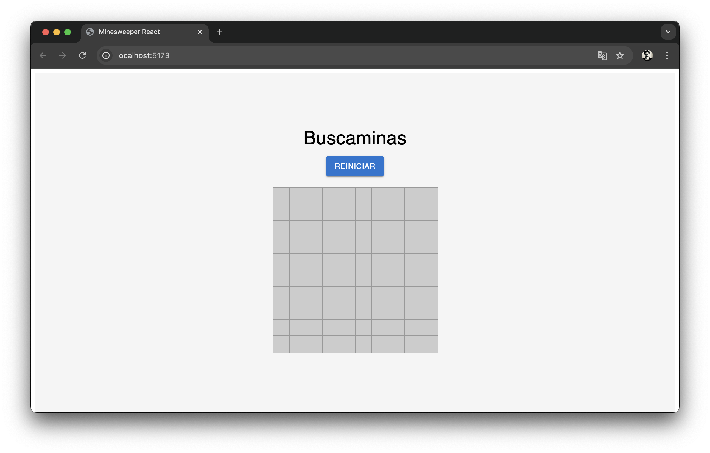
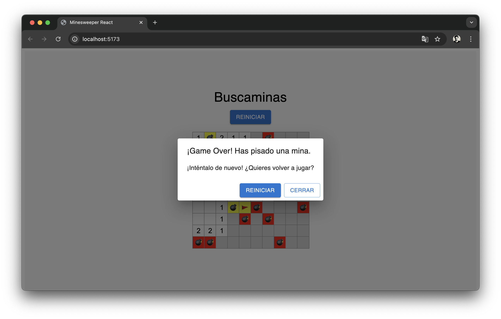
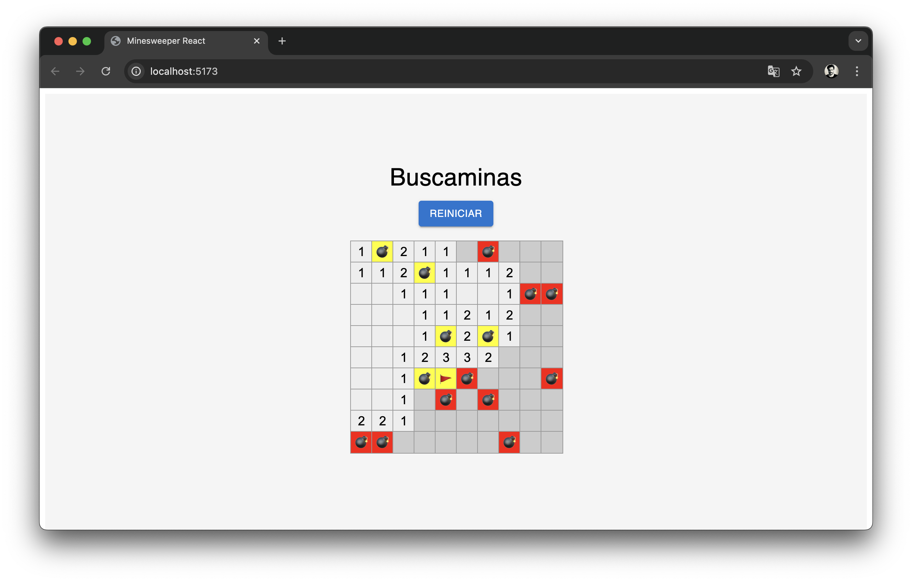
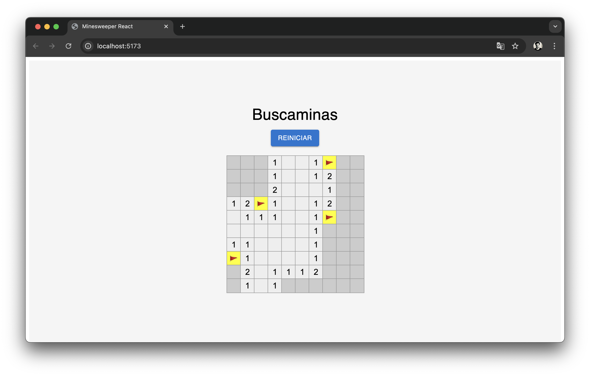
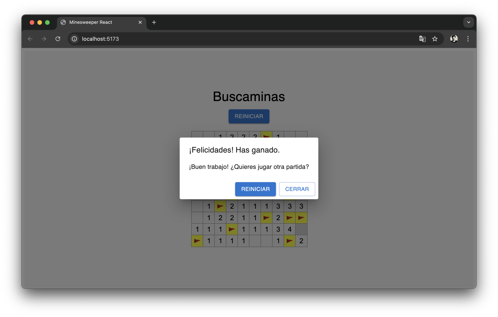

# Minesweeper

A classic Minesweeper game implemented in React. This project features an interactive and dynamic board where players can reveal cells, place flags, and win or lose based on their decisions.

## Features
- Interactive graphical interface built with React and Material-UI.
- Customizable board with a default size of 10x10 and 15 mines.
- Game logic implemented from scratch, including recursive cell revealing and random mine placement.
- Modal windows indicating game status (win or lose).
- Modern styling and centered design.

## Installation

Follow these steps to install and run the project locally:

### Prerequisites
Make sure you have installed:
- [Node.js](https://nodejs.org) (version 16 or higher)
- [npm](https://www.npmjs.com/) or [yarn](https://yarnpkg.com/)

### Installation Steps
1. Clone this repository to your local machine:
   ```bash
   git clone https://github.com/your-username/minesweeper-react.git
   ```
2. Navigate to the project directory:
   ```bash
   cd minesweeper-react
   ```
3. Install the project dependencies:
   ```bash
   npm install
   ```
   Or if using Yarn:
   ```bash
   yarn install
   ```

### Running the Project
To start the application in development mode:
```bash
npm run dev
```
Or with Yarn:
```bash
yarn dev
```

Then, open your browser and visit [http://localhost:5173](http://localhost:5173) (the URL may vary depending on your Vite configuration).

### Building for Production
To build the application for production:
```bash
npm run build
```
The static files will be located in the `dist` folder.

## How to Play
1. Left-click on cells to reveal them.
2. If you click on a cell with a mine, you lose.
3. Right-click on a cell to place or remove a flag.
4. The objective is to reveal all cells without mines.

## Project Structure

```
src/
├── App.jsx                         # Main component
├── main.jsx                        # Entry point
|── Components
|   └──Minesweeper/
│       ├── Cell.jsx                # Individual cell component
│       ├── GameBoard.jsx           # Board component
│       ├── GameContainer.jsx       # Container for centering the app
│       ├── MinesweeperApp.jsx      # Minesweeper app logic
│       ├── logic/
│       │   └── Minesweeper.js      # Game logic
│       └── styles/                 # CSS styles
│           ├── Cell.css
│           ├── GameContainer.css
│           └── MinesweeperApp.css
```

## Technologies Used
- **React**: For building the user interface.
- **Material-UI**: For modern components and styling.
- **CSS**: For custom game styling.
- **Vite**: For fast development and bundling.

## License
This project is licensed under the **GNU GENERAL PUBLIC LICENSE Version 3, 29 June 2007**.

## Contributions
Contributions are welcome! If you want to collaborate, please open an issue or submit a pull request in this repository.

## Screenshots

Here are some screenshots showcasing the Minesweeper game:

### Main Menu


### Mine Hit!


### Revel All Mines!


### Flags in Action


### Victory Screen!

